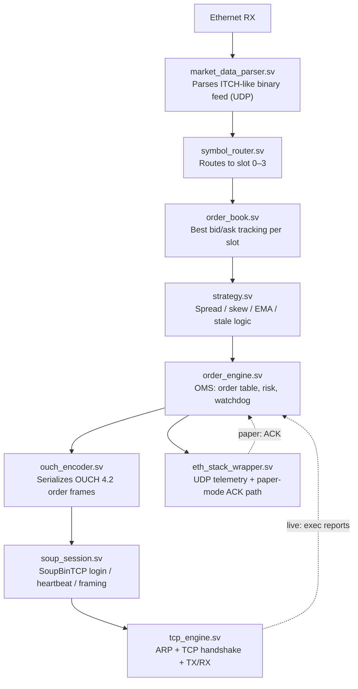

# HFT System

An FPGA-based high-frequency trading platform built on the Digilent Nexys Video (Xilinx Artix-7 XC7A200T).
Built for learning — market microstructure, FPGA engineering, and low-latency network protocols.

**What makes this worth a look:** a TCP/IP stack, SoupBinTCP session layer, and OUCH 4.2
order-entry protocol implemented entirely in SystemVerilog — not a soft-core CPU running C,
actual RTL parsing ITCH-style market data, tracking an order book, and emitting real exchange
protocol frames, hardware-validated end to end including a live TCP handshake against a
software exchange simulator. Backtests are held to the same bar as the RTL: several rounds of
this project involved finding and fixing real bugs in the strategy's own P&L accounting (see
`docs/OVERVIEW.md` for the trail), which is arguably the more interesting engineering story.

## What's Been Built

A complete market-making pipeline in hardware. Ethernet frame in → OUCH order out, no CPU in the critical path.



Both paths run simultaneously:
- **Paper mode:** FPGA → UDP → `ack_simulator.py` → UDP ACK → FPGA
- **Live mode:** FPGA → TCP → exchange → execution reports → TCP → FPGA

## Key Numbers

| Metric | Value |
|--------|-------|
| FPGA clock | 125 MHz (8 ns period) |
| Latest build WNS | +0.002 ns (timing met, margin is tight) |
| Pipeline latency (sim) | ~8 cycles (~64 ns) |
| Symbols supported | 4 simultaneous (AVAX/LINK/AAVE/INJ) |
| Testbench coverage | 32/32 — strategy 20/20, TCP 6/6, e2e 6/6, NASDAQ 2/2 |
| ITCH parse speed (Rust) | 423M messages in ~2 min |
| Best MM result (NASDAQ ITCH) | AMD $496/hr (Oct 2019); AAPL avg $148/hr over 3 dates |
| Best bar backtest (2yr Alpaca) | NVDA mean-reversion $5,444, Sharpe=11 |

## Hardware Features

| Phase | Feature | Status |
|-------|---------|--------|
| 11 | UART price_base config (runtime price calibration) | ✓ HW validated |
| 15 | OMS order table + watchdog (10-second safety timeout) | ✓ HW validated |
| 16 | Pre-trade risk: kill switch, fat-finger, position limits | ✓ HW validated |
| 17 | Inventory skew — FPGA adjusts quotes based on position | ✓ HW validated |
| 21A | Multi-symbol: 4 independent slots | ✓ HW validated |
| 21B | P&L tracking via UDP telemetry | ✓ HW validated |
| 22 | Dynamic EMA spread filter | ✓ HW validated |
| 23–24 | Timing closure, WNS positive | ✓ WNS=+0.001ns |
| 25 | Latency measurement at 4 pipeline stages | ✓ HW validated |
| 26 | End-to-end cocotb testbench (ITCH UDP in → OUCH out) | ✓ 6/6 pass |
| 31 | NASDAQ strategy on FPGA: real-ITCH replay testbench + itch_replay.py | ✓ sim-validated against the Python backtest |
| 27 | Full FPGA TCP: `tcp_engine` + `soup_session` + OUCH 4.2 | ✓ HW validated — Login Accepted, heartbeats confirmed |
| 28 | Binance live trading — queue position sim, stop-loss | ✓ HW validated — 10 orders/sec BUY/SELL on AAVE+INJ |

## Repository Layout

```
fpga/
  rtl/            SystemVerilog RTL
    core/         Clock, UART config, package
    eth/          Ethernet stack (TCP engine, SoupBinTCP, telemetry, arbiter)
    market_data/  ITCH parser, CDC bridge, symbol router
    order_book/   Per-slot BRAM order book
    order_entry/  Order engine, OUCH encoder, SOUP session
    strategy/     Quote logic, EMA filter, inventory skew
    top/          hft_top.sv — top-level integration
  tb/             Cocotb testbenches
    strategy/     20 unit tests
    tcp/          6 TCP/SoupBinTCP tests
    e2e/          6 end-to-end tests (ITCH → OUCH)
    nasdaq/       2 tests — replays real NASDAQ ITCH ticks through strategy.sv
  scripts/        build.tcl — Vivado project build

software/
  feed_bridge.py        Binance WebSocket → FPGA market data (UDP)
  ack_simulator.py      Paper-mode fill simulator
  monitor.py            Live P&L + latency telemetry (UDP)
  exchange_sim.py       Full exchange simulator (TCP, SoupBinTCP, OUCH 4.2)
  ouch_session.py       OUCH session client library
  itch_replay.py        Replay historical NASDAQ ticks → FPGA (UDP)

research/
  backtest/             Strategy backtests (NASDAQ ITCH + Alpaca bars)
  nasdaq/               ITCH 5.0 parser (Python + Rust), order book reconstructor
  collectors/           Binance WebSocket collector, Alpaca downloader, Pi sync script
  monitors/             DEX/CEX spread monitor (Avalanche / Trader Joe)

dashboard/              Web dashboard (P&L, positions, telemetry)
docs/                   OVERVIEW.md, protocol specs, architecture decision records
```

## Strategies

### A — CEX Crypto Market Making
Quote both sides on Binance AVAX/LINK/AAVE/INJ. Earn spread on fills. Implemented in hardware.
**Finding:** not viable. Originally blamed on adverse selection, but the binding constraint is
transaction costs — the backtest had modelled a 0.01% maker *rebate* where a retail Binance
account actually pays a ~0.10% maker *fee*. With that corrected, every symbol loses money at
every parameter setting; captured edge is only 5–10% of the fee paid. Colocation would not fix this.

### B — DEX/CEX Crypto Arbitrage (Avalanche)
Monitor Binance vs Trader Joe V1 spread. Trade when gap exceeds ~0.51% breakeven.
**Finding:** max observed spread (0.43%) is below breakeven. Viable only during volatility events.

### C — NASDAQ Stock Market Making (Mean Reversion)
Quote passively at best bid/ask on NASDAQ ITCH. Cancel on stale mid. Fade short-term moves.
**Backtest (real ITCH data, 3 dates, $20k notional/order, FIFO queue position):**
AAPL $128–184/hr, MSFT $42–158/hr, AMD $134–496/hr — every symbol/date profitable.
US equities venues pay maker rebates to everyone, which is the structural reason this
survives where the crypto strategy does not.

**Status:** running on the FPGA in simulation against real ITCH data (`fpga/tb/nasdaq/`),
with `software/itch_replay.py` ready to drive the board. Next: hardware run.

### D — Oslo Børs / Euronext
Oslo Børs uses NASDAQ ITCH — FPGA parser needs minor modifications.
Matching engine in Basildon (LD4). Norway has 3–4× latency advantage over US firms.
**Status:** research phase.

## Quick Start

```bash
# Build FPGA bitstream
& "C:\Xilinx\Vivado\2024.2\bin\vivado.bat" -mode tcl -source fpga/scripts/build.tcl

# Run live system (3 terminals)
python software/feed_bridge.py        # Binance → FPGA market data
python software/ack_simulator.py      # Paper-mode fills
python software/monitor.py            # Live P&L telemetry

# Run unit tests
python fpga/tb/strategy/runner_strategy.py   # 20/20 strategy tests
python fpga/tb/tcp/runner_tcp.py             # 6/6 TCP/SoupBinTCP tests
python fpga/tb/e2e/runner_e2e.py             # 6/6 end-to-end tests
python fpga/tb/nasdaq/runner_nasdaq.py       # 2/2 NASDAQ replay tests

# Replay historical NASDAQ ticks into the FPGA (paper trading)
python software/itch_replay.py --file research/data/nasdaq/aapl_20200130_ticks.csv --speed 100

# Exchange simulator (for TCP validation without live exchange)
python software/exchange_sim.py

# NASDAQ ITCH backtest (fast path via Rust parser)
.\research\nasdaq\itch_rs\target\release\itch_parser.exe --file research\data\nasdaq\01302020.NASDAQ_ITCH50.gz --symbol AAPL --out aapl_ticks.csv
python research/backtest/nasdaq_mm_backtest.py --ticks-file aapl_ticks.csv --symbol AAPL --sweep

# 2-year Alpaca bars backtest
python research/backtest/bars_backtest.py --sweep

# SSH to Raspberry Pi data collector (Tailscale; set $PI_HOST=user@tailscale-ip)
ssh $PI_HOST
bash research/collectors/sync_from_pi.sh    # Pull tick CSVs to laptop
```

## Documentation

- [docs/OVERVIEW.md](docs/OVERVIEW.md) — full system description, phase history, key numbers, roadmap
- [docs/adr/](docs/adr/) — architecture decision records (TCP engine design, dual paper/live path, etc.)
